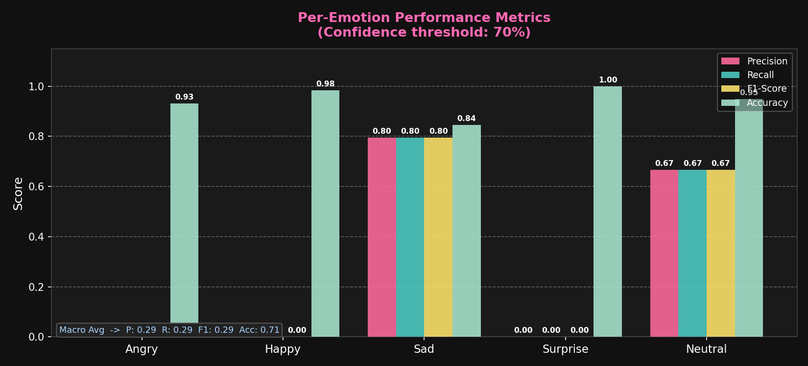
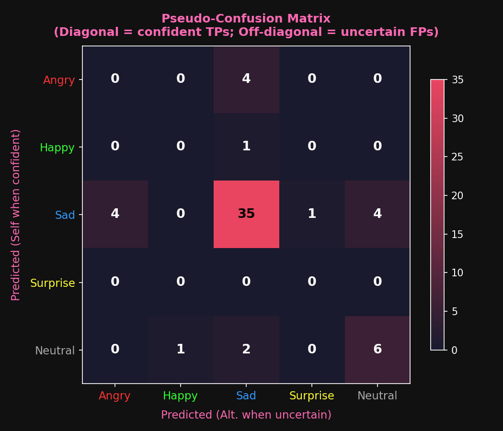
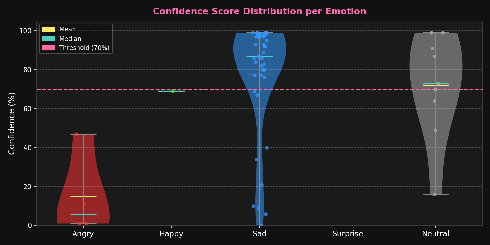

# AI Face Emotion Detection System

## Description
This project detects human emotions in real-time using AI and displays them with a graphical HUD.

## Features
- Real-time emotion detection
- Emotion timeline visualization
- Session summary dashboard
- Emotion logging
- FPS counter

## Technologies Used
- Python
- OpenCV
- DeepFace

## How to Run
1. Install requirements:
   pip install -r requirements.txt

2. Run:
   python main.py

## Controls
- Press Q to quit
- Press any key to close summary

## Output Screenshots

### 😄 Happy Detection

### 😐 Neutral Detection

### 📊 Session Summary

## Performance Metrics
- Overall Accuracy: 70.7% (confidence threshold ≥ 70%)
- Macro F1-Score: 0.292
- Dominant emotion tracked per session

## Graphs Generated
| Graph | Description |
|-------|-------------|
| graph_1_metrics_bar.png | Precision / Recall / F1 per emotion |
| graph_2_confusion_matrix.png | Pseudo-confusion matrix heatmap |
| graph_3_confidence_dist.png | Confidence distribution violin plot |
| graph_4_emotion_timeline.png | Emotion changes over session |
| graph_5_precision_recall.png | PR curve + Radar chart |

## Graph Previews
### 📊 Metrics Bar Chart

### 🔥 Confusion Matrix

### 🎻 Confidence Distribution

